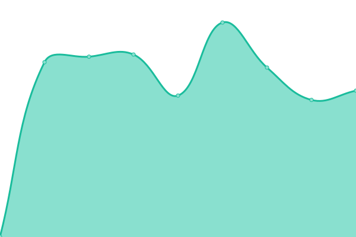
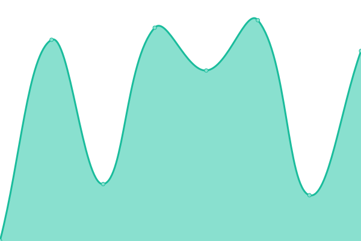

# [📈 Live Status](https://cloudmppba.github.io/upptime): <!--live status--> **🟧 Partial outage**

This repository contains the open-source uptime monitor and status page for [cloudmppba](https://cloudmppba.github.io/upptime), powered by [Upptime](https://github.com/upptime/upptime).

With [Upptime](https://upptime.js.org), you can get your own unlimited and free uptime monitor and status page, powered entirely by a GitHub repository. We use [Issues](https://github.com/cloudmppba/upptime/issues) as incident reports, [Actions](https://github.com/cloudmppba/upptime/actions) as uptime monitors, and [Pages](https://cloudmppba.github.io/upptime) for the status page.

<!--start: status pages-->
<!-- This summary is generated by Upptime (https://github.com/upptime/upptime) -->
<!-- Do not edit this manually, your changes will be overwritten -->
<!-- prettier-ignore -->
| URL | Status | History | Response Time | Uptime |
| --- | ------ | ------- | ------------- | ------ |
|  [Recreo](https://recreo.gba.gob.ar) | 🟩 Up | [recreo.yml](https://github.com/cloudmppba/upptime/commits/HEAD/history/recreo.yml) | 

 798ms
     
 | 

<a href="https://cloudmppba.github.io/upptime/history/recreo">100.00%</a>
    

|  [Recreo Minio](https://minio.recreopba.com.ar/public/img/logo.svg) | 🟩 Up | [recreo-minio.yml](https://github.com/cloudmppba/upptime/commits/HEAD/history/recreo-minio.yml) | 

 303ms
     
 | 

<a href="https://cloudmppba.github.io/upptime/history/recreo-minio">100.00%</a>
    

|  [Recreo api graphql](https://recreo.gba.gob.ar/graphql) | 🟩 Up | [recreo-api-graphql.yml](https://github.com/cloudmppba/upptime/commits/HEAD/history/recreo-api-graphql.yml) | 

 178ms
     
 | 

<a href="https://cloudmppba.github.io/upptime/history/recreo-api-graphql">100.00%</a>
    

|  [Recreo admin login](https://recreo.gba.gob.ar/admin/login) | 🟩 Up | [recreo-admin-login.yml](https://github.com/cloudmppba/upptime/commits/HEAD/history/recreo-admin-login.yml) | 

 172ms
     
 | 

<a href="https://cloudmppba.github.io/upptime/history/recreo-admin-login">100.00%</a>
    

|  [Actiba](https://actiba.mp.gba.gob.ar) | 🟩 Up | [actiba.yml](https://github.com/cloudmppba/upptime/commits/HEAD/history/actiba.yml) | 

 693ms
     
 | 

<a href="https://cloudmppba.github.io/upptime/history/actiba">100.00%</a>
    

|  Guias Mineras | 🟩 Up | [guias-mineras.yml](https://github.com/cloudmppba/upptime/commits/HEAD/history/guias-mineras.yml) | 

 765ms
     
 | 

<a href="https://cloudmppba.github.io/upptime/history/guias-mineras">100.00%</a>
    

|  [Ronda de Negocios HML](https://hml.rondadenegocios.mp.gba.gob.ar/api/) | 🟥 Down | [ronda-de-negocios-hml.yml](https://github.com/cloudmppba/upptime/commits/HEAD/history/ronda-de-negocios-hml.yml) | 

 861ms
     
 | 

<a href="https://cloudmppba.github.io/upptime/history/ronda-de-negocios-hml">99.37%</a>
    

<!--end: status pages-->

[**Visit our status website →**](https://cloudmppba.github.io/upptime)

## 📄 License

- Powered by: [Upptime](https://github.com/upptime/upptime)
- Code: [MIT](./LICENSE) © [Anand Chowdhary](https://anandchowdhary.com), supported by [Pabio](https://pabio.com)
- Data in the `./history` directory: [Open Database License](https://opendatacommons.org/licenses/odbl/1-0/)
